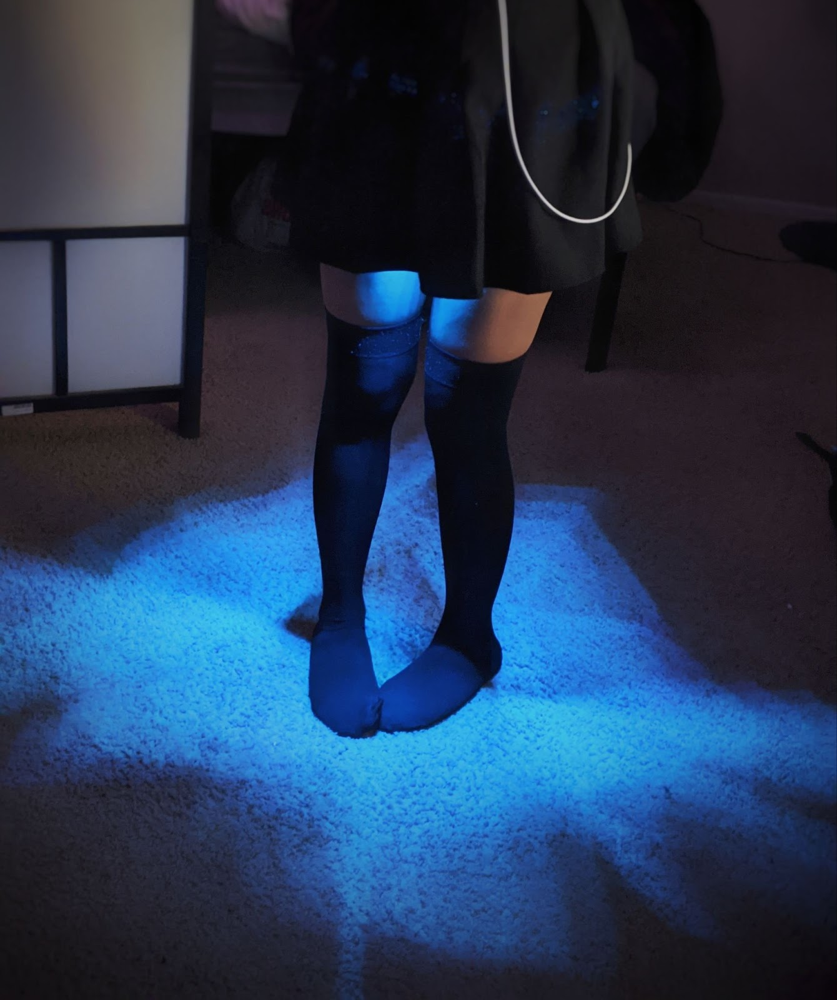

# led-skirt

<p align="center">

</p>

Source code for the LED strip and Xiao RP2040 microcontroller that goes in my
miniskirt.

## Flashing

```sh
./flash.sh # list all presets
./flash.sh rainbow # flash the rainbow preset
```
